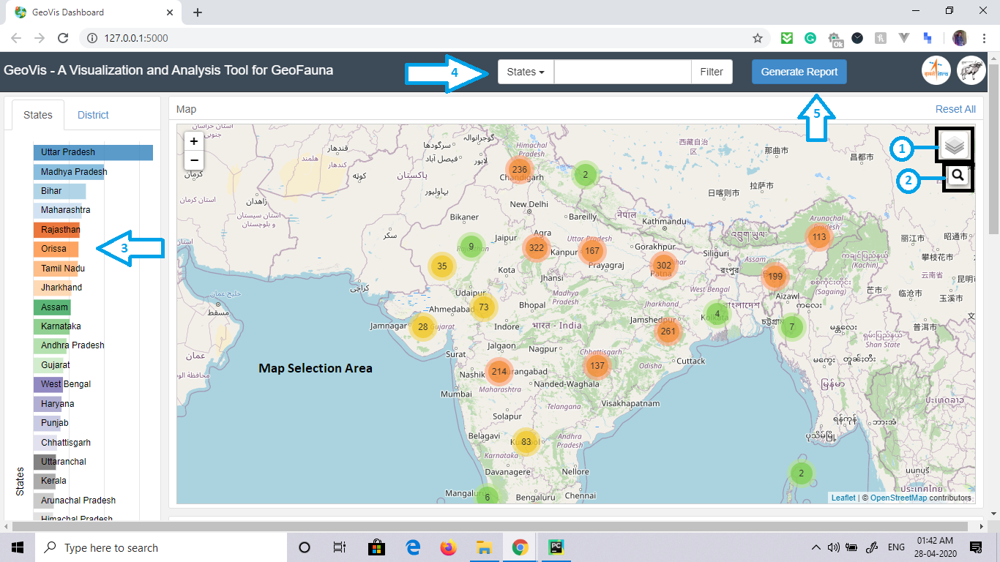
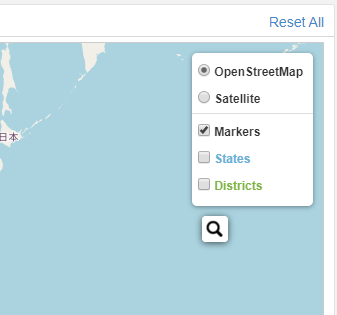
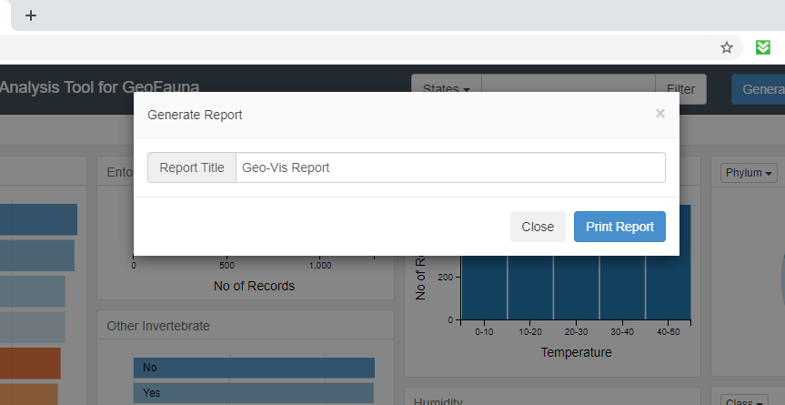
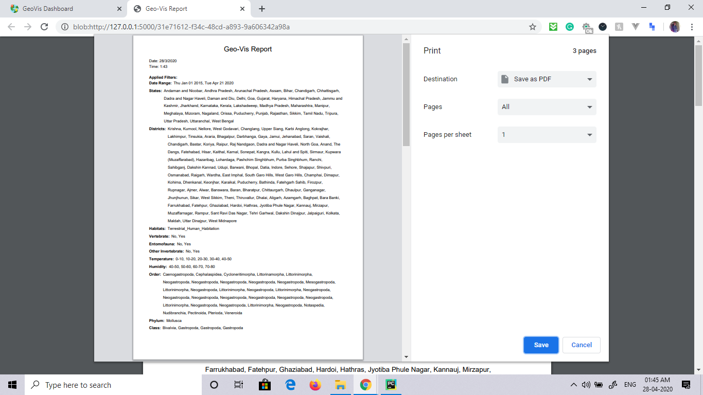
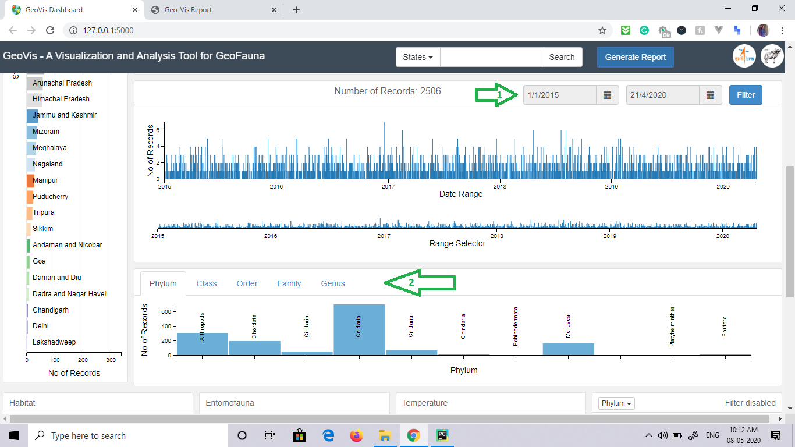
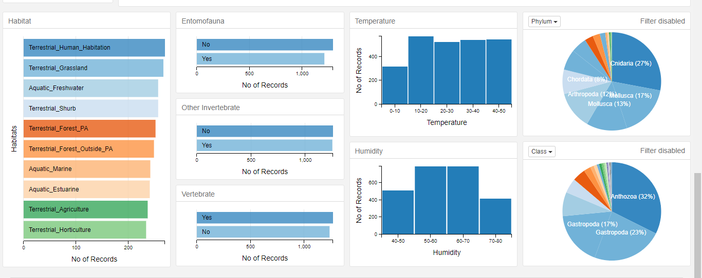

# GeoVisualization
Version 2.0 of Geo-Vis Data Visualization Tool for GeoFauna App.

This Web-Tool is used to read the data from GeoFauna App and Provide Insight into it. [Demo Video](https://youtu.be/PLp2uYX2rEk)

## Abstract
- The overall purposes of this project are to systematically collect wildlife survey data in a standard format.
- Organize, manage, analyse and visualise the collected data.
- It uses the geospatial information in the data to build informative visual analysis of the geotagged  data.
- This data then can be used to make informed decisions based on factual data collected from the field survey

Use the .exe file in Release to run it diectly. [Link to download](https://github.com/arunavo4/GeoVisualization/releases/download/v1.0.1/GeoVis-5-EXE.rar)

## Map Area

1. Layer Selection

Select Base layers [Open StreetMap or Satellite view]

And Overlay layers [Markers / States Boundaries / District Boundaries]

1. Search using Unique ID of Records. Useful when you wanna locate a specific record on the Map.
2. States and Districts Row Chart.

Here each of the rows are selectable, selecting them instantly filters the whole data, all the other charts and the Map displays the filtered data.

1. This is a Search Option where you can select the specific column and then Search on that and this will apply the corresponding filter on the Chart and Map.

1. Generate Report

This Generates a Report based on the Selected Filters in the Charts.

Here there is an option to Set the Title of the Report as required.

The Generated Report:

## Timeline Area

Here the Data Timeline is Displayed.

1. Select the Range of dates to display data in that corresponding date range.
2. Here the Hierarchical data selection is there with Phylum, Class, etc..

## Charts Area

Here the rest of the data is presented in its own charts and all of them are selectable and filterable except the two Pie Charts as they represent the same data as the above BarCharts. To curb confusion these two have selection disabled.

